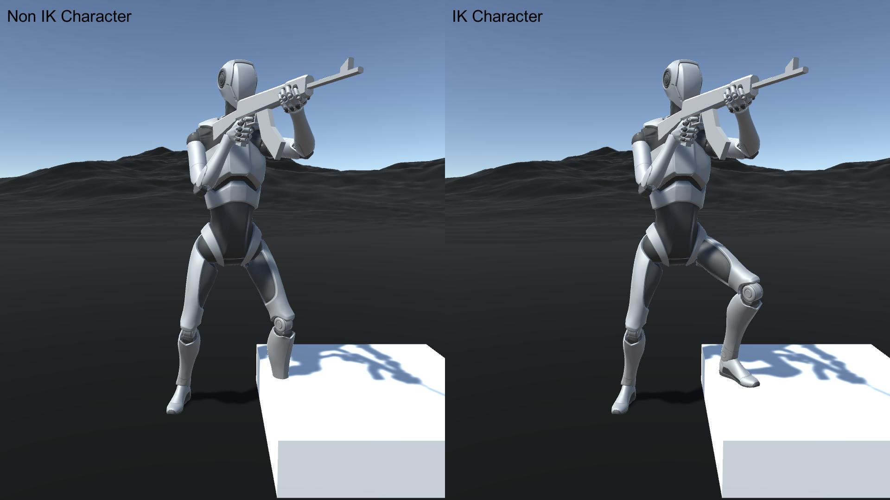
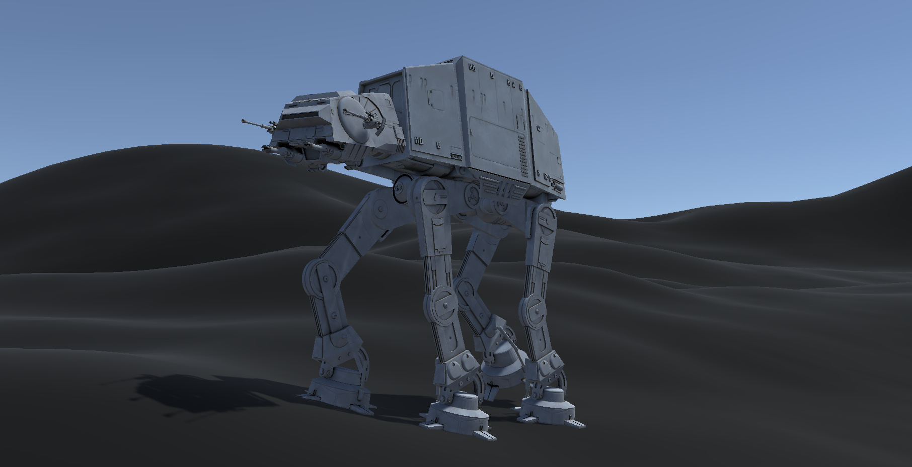

# IKFootPlacement

IKFootPlacement is a free C# script for Unity engine that controls the position and rotation of character’s feet, relative to the ground beneath. The script supports characters with any number of legs, which means it does not require the usage of a humanoid avatar. Instead it works with the use of Two Bone IK Constraint provided with the the Animation Rigging package from Unity.

## Features

- No need to use humanoid avatar,
- Support any number of legs on a character,
- Has multiple parameters to controls the script,
- Uses IAnimationJob interface for better optimisation,
- The IKSetup script provides a quick and automatic configuration.

## Repository Contents

The repository includes the following C# scripts:

1. **iKFootPlacement.cs**  
   A MonoBehaviour class that casts a raycast to detect the ground surface and passes the necessary information to the iKFootPlacementJob struct,

2. **iKFootPlacementJob.cs**  
   An IAnimationJob struct that calculates and applies the position and rotation offset for each foot,

3. **iKSetup.cs**  
   A MonoBehaviour class that automates the configuration of the IKFootPlacement script on Your character, simplifying the setup process,

4. Other, additional scripts.

## Requirements and Dependencies

- **Unity Engine:** version 2020.2.0 is a minimum; version 2021.2.4 or higher is recommended,
- **Animation Rigging package:** version 1.0.3 is a minimum; version 1.1.1 or higher is recommended.

## Installation

You can download and install this package in one of two ways:

1. **Download as a custom git package:**  
   - In Unity engine open the Package Manager window, 
   - Press the + icon in the top left corner,
   - Choose `Add package from git URL...`,
   - In the text field type:

   `https://github.com/plonkabartosz/IKFootPlacement.git`

2. **Download from the Unity Asset Store:**  
   The asset is also freely available on the Unity Asset Store: 
   [IKFootPlacement - Free IK Script](https://u3d.as/3vyY)

## Usage

1. **Attach the IKSetup script to Your character:**
   - Create an empty scene,
   - Add Your character to the scene,
   - Make sure the character has an Animator component attached,
   - Attach the IKSetup script to Your character,
   - Follow the instructions shown in the Inspector tab,
   - Begin setup by pressing `Start Setup` button,
   - If done properly You can remove the IKSetup script.

2. **Configure the Script:**  
   After adding the IKFootPlacement script, adjust it's parameters in the Inspector according to Your character’s setup.

3. **Run the Scene:**  
   When you run the scene, the script will cast rays beneath the character’s feet, calculate the appropriate offsets using the `iKFootPlacementJob` and adjust the IK controls in real time.

## License

This project and it's contents are distributed under the [CC BY 4.0 International](https://creativecommons.org/licenses/by/4.0/) license.

## Video Presentation

You can watch the video presentation of this script here: [LINK](https://www.youtube.com/@lifelike-motion)
